EDA: Revenue Optimization for an Affiliate Website
================
Tobias Zwingmann
9 1 2019

Match Website-URLs with Amazon Affiliate Tracking IDs
=====================================================

Idea: Scrape Website and associate URLs with Tracking ID indicated as "tag=..." in outgoing links.

Read a Sitemap to fetch all URLs a website has for scraping
-----------------------------------------------------------

``` r
if (file.exists("data/html_urls.rds")) {
  
  html_urls <- read_rds("data/html_urls.rds")

} else {
  
#Folgenden Code nur ausführen, wenn kein rds vorhanden ist:

 sitemap <- read_xml("https://www.welches-hdmi-kabel.de/sitemap.xml")
 # This sitemap is nested so we have to get all sitemaps first

 sitemap_urls <- sitemap %>%
   xml_children() %>%
   xml_text() %>%
   str_replace_all(".xml.*", ".xml")

 sitemap_urls <- sitemap_urls[-1]

 html_urls = tibble("value" = character())

 n = length(sitemap_urls)

 #We iterate through each sitemap and extract the URLs starting with https:...
 for (i in 1:n ){
   html_urls <- rbind(html_urls,
   sitemap_urls[i] %>%
   read_xml() %>%
   xml_children() %>%
   xml_children() %>%
   xml_text() %>%
   as_tibble() %>%
   filter(str_detect(value, 'https:'))
 )
   }
 write_rds(html_urls, "data/html_urls.rds")
}
```

Scrape the URLs from the sitemap for Amazon Affiliate Tag. If found, write into table and link to the resp. URL. Count the number of occurences of outgoing links per Website.
------------------------------------------------------------------------------------------------------------------------------------------------------------------------------

``` r
#Scrape Webseiten nach Amazon Affiliate Tag

if (file.exists("data/matched_tags_to_url.rds")) {

  matched_tags_to_url <- read_rds("data/matched_tags_to_url.rds")

} else {

 matched_tags_to_url = tibble("Tag" = character(),
                         "n" = integer(),
                         "URL" = character())

 n = nrow(html_urls)

 j = 1L

 for (i in 1:n) {

   url <-  html_urls[[1]][i]

   parsed_url_links <-
     url %>%
     read_html() %>%
     html_nodes("body") %>%
     html_nodes("a") %>%
     html_attr("href") %>%
     as.tibble()

    if(nrow(parsed_url_links %>% filter(str_detect(value, "tag="))) > 0) {
     #Code wird nur ausgeführt, wenn ein ausgehender Link mit Tag= auf der Webseite zu finden ist:
      matched_tags_to_url[j,] <-
       parsed_url_links %>%
       filter(str_detect(value, "tag=")) %>%
       mutate(Tag = str_extract(value, "tag=.*-21")) %>%
       mutate(Tag = str_remove(Tag, "tag=")) %>%
       group_by(Tag) %>%
       count %>%
       mutate(URL = url)
      j <- j+1L
    }

 }
 rm(parsed_url_links, url, j, i, n)
 write_rds(matched_tags_to_url, "data/matched_tags_to_url.rds")

}
```

Umsätze (Orders) von Amazon
===========================

``` r
#Umsätze
fee_orders_xml <- read_xml("data/Amazon Orders 18.12.2017 - 16.12.2018/1549029224178-Fee-Orders-7a68a8a6-7342-4f73-a750-3e26a56c5147-XML.xml")

fee_orders_xml <-
  fee_orders_xml %>% 
  xml_children() %>% 
  xml_children() %>% 
  xml_attrs()

fee_orders_tbl <-
  fee_orders_xml %>%
  as.data.frame() %>% 
  t %>% 
  as_tibble(row.names=F)

rm(fee_orders_xml)

#Aggregiere Bestellungen auf Tagesebene
fee_orders_daily_tbl <-
  fee_orders_tbl %>% 
  mutate(Datum = parse_date_time(Datum, "Ymd HMS")) %>% 
  mutate(Datum = as.Date(Datum)) %>% 
  mutate(Preis = as.numeric(str_replace(Preis, ",", ".")),
         Menge = as.integer(Menge)) %>%
  mutate(Umsatz = Preis * Menge) %>% 
  group_by(Tag, Datum) %>% 
  summarise(Umsatz = sum(Umsatz)) %>% 
  mutate(CW = get_cw_and_year_from_date(Datum))

fees_weekly_tbl <- fee_orders_daily_tbl %>% 
  group_by(Tag, CW) %>%
  summarise(Umsatz = sum(Umsatz))
```

Klicks auf Amazon Partnerlinks
------------------------------

``` r
file.names <- list.files("data/Amazon Klicks 18.12.2017 - 16.12.2018/")
path.names <- paste0("data/Amazon Klicks 18.12.2017 - 16.12.2018/", file.names)

clicks_tbl <- tibble(
  "Tracking-ID" = character(),
  "Klicks" = numeric(),
  "Artikel bestellt" = numeric(),
  "Artikel geliefert" = numeric(),
  "Umsatz (€)" = numeric(),
  "Ad Gebühren (€)"  = numeric()
  )

clicks_tbl <- map_df(path.names, bind_clicks_csv_to_tbl) #Diese Tabelle enthält noch keine Angaben zum Datum

clicks_date_tbl <- map_df(path.names, bind_click_dates_csv_to_tbl) #Diese Tabelle enthält nur Datum und Dateiname

clicks_weekly_tbl <-
  clicks_tbl %>% 
  left_join(clicks_date_tbl) %>% 
  separate(Range, c("Start", "End"), " to ") %>% 
  select(-File) %>% 
  mutate(Start = mdy(Start),
         End = mdy(End),
         CW = get_cw_and_year_from_date(Start),
         CW_check = get_cw_and_year_from_date(End),
         DaysInWeek = End - Start + 1
         )%>% 
  arrange(CW) %>%
  rename(Tag = `Tracking-ID`)
```

    ## Joining, by = "File"

``` r
# Sanity Checks: Die einzelnen CSV-Files wurden manuell aus dem Amazon Partnernet generiert.
# Hier wird geprüft, ob Start- und Enddatum des jeweiligen CSV-Files in der gleichen Kalenderwoche sind und ob
# jede Kalenderwoche aus 7 Einzeltagen besteht.

if (all(clicks_weekly_tbl$CW == clicks_weekly_tbl$CW_check) & all(clicks_weekly_tbl$DaysInWeek == 7)) {
  clicks_weekly_tbl <- 
    clicks_weekly_tbl %>% 
    group_by(Tag, CW) %>% 
    summarise(Klicks = sum(Klicks))
} else {
  print("Prüfe Rohdaten im Ordner Amazon Klicks")
}
```

Pageviews from Google Analytics
===============================

``` r
file.names <- list.files("data/Google Analytics 01.12.2017 - 31.12.2018/")
path.names <- paste0("data/Google Analytics 01.12.2017 - 31.12.2018/", file.names)

pageviews_tbl <- tibble(
  "Page path level 1" = character(),
  "Date" = character(),
  "Pageviews" = character(),
  "Unique Pageviews" = character(),
  "Avg. Time on Page" = character(),
  "Bounce Rate" = character(),
  "% Exit" = character()
  )


pageviews_tbl <- map_df(path.names, bind_pageview_csv_to_tbl)
#Parsing Fehler verursacht durch CSV-Format, welches eigentlich 2 Berichte in einer Datei enthält

#Clean up data frame 
pageviews_tbl <- pageviews_tbl %>% 
  filter(!is.na(`Page path level 1`)) %>% 
  filter(!is.na(Date)) %>% 
  mutate(URL = str_remove(`Page path level 1`, "/$")) %>% #Entferne Slashes am Ende
  filter(str_detect(URL, "^/")) %>% 
  mutate(Pageviews = str_remove(Pageviews, ","),
         Pageviews = as.numeric(Pageviews)) %>% 
  group_by(URL, Date) %>%
  summarise(Pageviews = sum(Pageviews)) %>%
  ungroup() %>% 
  mutate(URL = paste0("https://www.welches-hdmi-kabel.de",URL)) %>% 
  mutate(CW = get_cw_and_year_from_date(ymd(Date)))

pageviews_weekly_tbl <- 
  pageviews_tbl %>% 
  group_by(URL, CW) %>% 
  summarize(Pageviews = sum(Pageviews))
```

Zusammenführen von Views, Klicks und Umsätzen in ein einheitliches Datenset
---------------------------------------------------------------------------

``` r
# Kleinster Granularitätsfaktor: Kalenderwoche Tag und URL
date_range <- fees_weekly_tbl$CW %>% unique() %>% sort

weekly_raw_tbl <-
  expand(matched_tags_to_url, Tag, date_range ) %>%  #Basis Dataframe mit jeder Kombination aus Tag und CW in Daterange
  rename(CW = date_range) %>% 
  left_join(matched_tags_to_url) %>%
  mutate(URL = str_remove(URL, "/$")) %>% 
  left_join(pageviews_weekly_tbl, by=c("URL", "CW")) %>% 
  left_join(clicks_weekly_tbl, by=c("CW", "Tag")) %>% 
  left_join(fees_weekly_tbl, by=c("CW", "Tag")) %>%
  mutate(Pageviews = replace_na(Pageviews, 0),
         Klicks = replace_na(Klicks, 0),
         Umsatz = replace_na(Umsatz, 0)) %>% 
  mutate(Umsatz = replace_na(Umsatz, 0)) %>% 
  mutate(CTR = ifelse(Pageviews == 0, 0, round(Klicks / Pageviews,4))) %>% 
  mutate(RPC = ifelse(Klicks == 0, 0, round(Umsatz / Klicks, 4)))
```

    ## Joining, by = "Tag"

``` r
write_rds(weekly_raw_tbl, "data/weekly_raw_tbl.rds")

weekly_raw_tbl %>% 
  head()
```

    ## # A tibble: 6 x 9
    ##   Tag     CW         n URL           Pageviews Klicks Umsatz     CTR   RPC
    ##   <chr>   <chr>  <int> <chr>             <dbl>  <dbl>  <dbl>   <dbl> <dbl>
    ## 1 25-fes… 2017-…     2 https://www.…       669     10    0   0.0149    0  
    ## 2 25-fes… 2017-…     2 https://www.…       942      9    0   0.00960   0  
    ## 3 25-fes… 2018-…     2 https://www.…       768      7   83.3 0.0091   11.9
    ## 4 25-fes… 2018-…     2 https://www.…       615      7    0   0.0114    0  
    ## 5 25-fes… 2018-…     2 https://www.…       621      5    0   0.0081    0  
    ## 6 25-fes… 2018-…     2 https://www.…       565     10    0   0.0177    0

Exploration
===========

Wöchentliche Trends allgemein
-----------------------------

### ... nach Seitenaufrufen

``` r
#Data Transformation
weekly_raw_tbl %>% 
  select(CW, Pageviews) %>% 
  group_by(CW) %>% 
  summarise(Pageviews = sum(Pageviews)) %>%
  
  #Visualisation
  ggplot(aes(CW, Pageviews)) +
  geom_line(group=1) +
  ggtitle("Entwicklung der wöchentlichen Seitenaufrufe im Zeitverlauf") +
  theme_minimal() +
  theme(axis.text.x = element_text(angle = 90, hjust = 1)) +
  expand_limits(y=0)
```

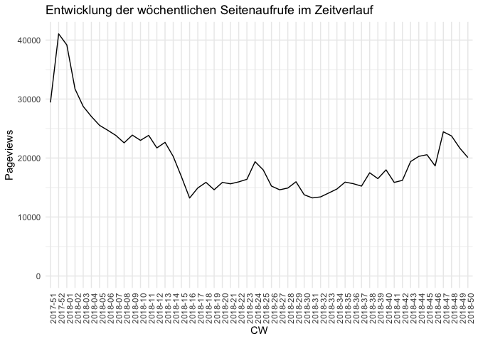

### ... nach Klicks

``` r
#Data Transformation
weekly_raw_tbl %>% 
  select(CW, Klicks) %>% 
  group_by(CW) %>% 
  summarise(Klicks = sum(Klicks)) %>%
  
  #Visualisation
  ggplot(aes(CW, Klicks)) +
  geom_line(group=1) +
  ggtitle("Entwicklung der wöchentlichen Klicks im Zeitverlauf") +
  theme_minimal() +
  theme(axis.text.x = element_text(angle = 90, hjust = 1)) +
  expand_limits(y=0)
```

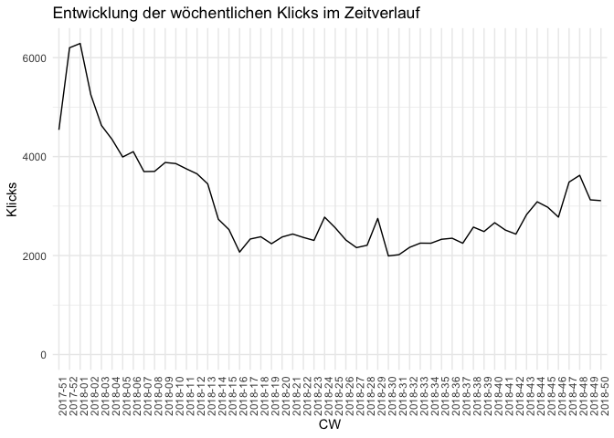

### ... nach Umsätzen

``` r
#Data Transformation
weekly_raw_tbl %>% 
  select(CW, Umsatz) %>% 
  group_by(CW) %>% 
  summarise(Umsatz = sum(Umsatz)) %>%
  
  #Visualisation
  ggplot(aes(CW, Umsatz)) +
  geom_line(group=1) +
  ggtitle("Entwicklung der wöchentlichen Umsätze im Zeitverlauf") +
  theme_minimal() +
  theme(axis.text.x = element_text(angle = 90, hjust = 1)) +
  expand_limits(y=0)
```

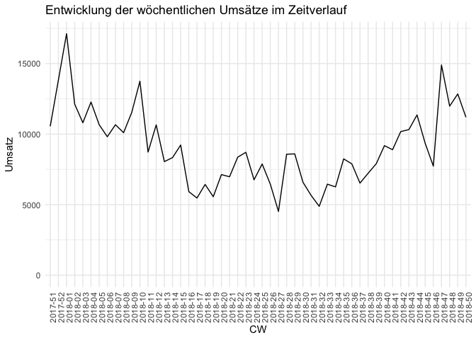

Seitenaufrufe, Umsätze, Klicks in einem Chart
---------------------------------------------

Erkenntnis: Alle dre Variablen korrelieren miteinander, der Umsatz bricht aber nicht so stark ein, wie die anderen Werte (Klicks)

``` r
weekly_raw_tbl %>% 
  select(CW, Pageviews, Klicks, Umsatz) %>% 
  group_by(CW) %>% 
  summarise(Umsatz = sum(Umsatz),
            Klicks = sum(Klicks),
            Pageviews = sum(Pageviews)) %>%
  ungroup() %>%
  #Skaliere alle Werte zwischen 0 und 1
  mutate(Umsatz = rescale(Umsatz,to=c(0,1)),
         Klicks = rescale(Klicks, to=c(0, 1)),
         Pageviews = rescale(Pageviews, to=c(0, 1))) %>%
  gather(key = Kriterium, value = Wert, -CW) %>% 
  
  #Visualisation
  ggplot(aes(x=CW, y=Wert, color=Kriterium)) +
  geom_line(aes(group = Kriterium), size = 1.1) +
  ggtitle("Entwicklung der wöchentlichen Seitenaufrufe, Klicks und Umsätze im Zeitverlauf") +
  theme_minimal() +
  theme(axis.text.x = element_text(angle = 90, hjust = 1),
        legend.position = "bottom") +
  expand_limits(y=0)
```

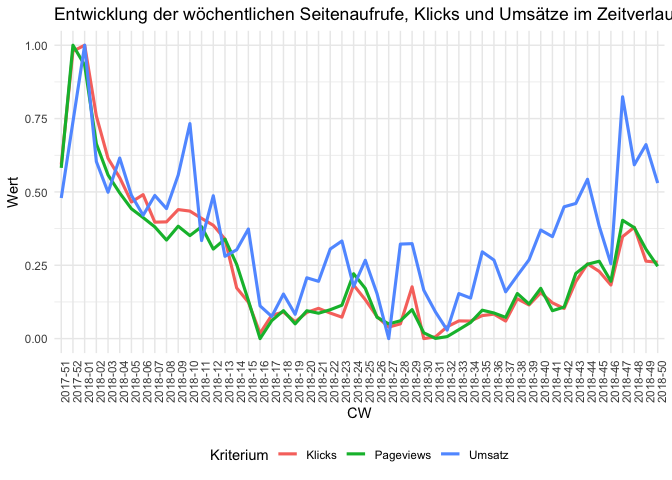

Analyse der Umsätze und Seitenaufrufe für Wochentage
====================================================

``` r
#Temporary Tables for Join
a = pageviews_tbl %>% 
  mutate(Wochentag = weekdays(ymd(Date))) %>% 
  select(Wochentag, Pageviews) %>% 
  group_by(Wochentag) %>% 
  summarise(Pageviews = sum(Pageviews)) %>% 
  mutate(Pageviews_perc = prop.table(Pageviews))


b = fee_orders_daily_tbl %>%
  ungroup() %>% 
  mutate(Wochentag = weekdays(ymd(Datum))) %>% 
  select(Wochentag, Umsatz) %>% 
  group_by(Wochentag) %>% 
  summarise(Umsatz = sum(Umsatz)) %>% 
  mutate(Umsatz_perc = prop.table(Umsatz))

#Data Transformation
left_join(a, b, by="Wochentag") %>% 
  select(Wochentag, Pageviews_perc, Umsatz_perc) %>% 
  gather(key = Kriterium, value = Prozent, -Wochentag) %>%
  mutate(Wochentag = fct_relevel(Wochentag,c("Monday", "Tuesday", "Wednesday", "Thursday", "Friday", "Saturday", "Sunday"))) %>% 
  
  ggplot(aes(x=Wochentag, y=Prozent, fill=Kriterium)) +
  geom_bar(position="dodge", stat="identity")
```

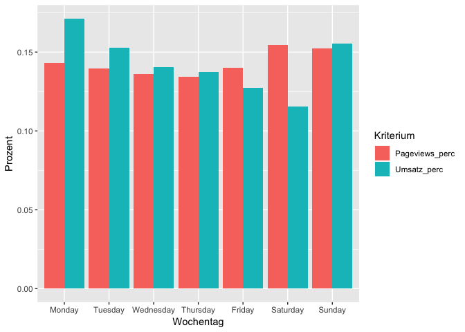

Analyse der Kennzahlen CTR und RPC
----------------------------------

Wir sind interessiert an einem Benchmark der Kennzahlen CTR und RPC. Die erste Frage: Gibt es innerhalb dieser Kennzahlen überhaupt Varianz und wenn ja wie stark ist diese ausgeprägt?

### Verteilung der CTR insgesamt

Einschränkung: Seitenaufrufe mindestens 50 (hier: pro Woche). Sonst keine verlässlichen Zahlen möglich. Es scheint mindestens 3 Peaks zu geben: um 0.18, 0.27 und unter 0.05. Erkenntnis: Ja, es existiert Varianz. Die CTR streut sogar relativ stark um den Mittelwert XXX. Wobei Mittelwert hier offensichtlich kein besonders gutes Lagemaß ist.

``` r
CTR_mean <- weekly_raw_tbl %>% filter(Pageviews >= 50) %>% select(CTR) %>% unlist %>% mean

weekly_raw_tbl %>%
  filter(Pageviews >= 50) %>% 
  select(CTR) %>%
  ggplot(aes(x=CTR)) +
  geom_histogram(binwidth = 0.01) + 
  geom_vline(aes(xintercept=CTR_mean))
```

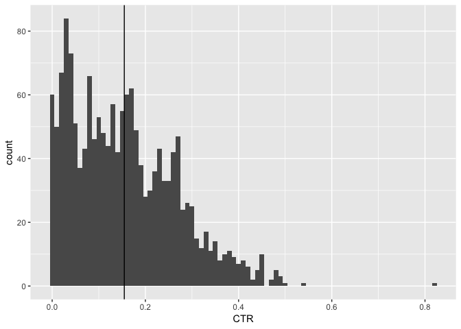

Schwankt der CTR in Abhängigkeit von der Zeit? Ergebnis: Nein, der CTR ist über die Zeit relativ konstant, hier scheint kein Muster vorzuliegen

``` r
weekly_raw_tbl %>%
  filter(Pageviews >= 50) %>% 
  select(CTR, CW) %>%
  ggplot(aes(y=CTR, x=CW)) +
  geom_boxplot() +
  theme(axis.text.x = element_text(angle = 90, hjust = 1))
```

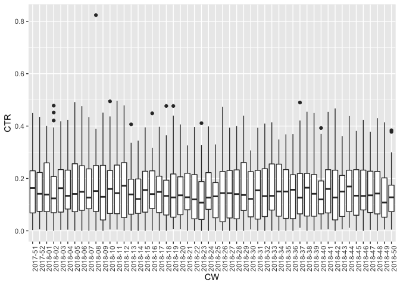

Vermutung: CTR variiert je nach Seiten-URL, also manche Seiten performen gut, andere weniger. Erkenntnis: Stimmt, der CTR schwankt stark nach Seiten-URL (Mittelwert 0.4 und 0.01). Die Sortierung der X-Achse hier erfolgt anhand der absteigenden Seitenaufrufe gesamt dieser Seiten-URL. Zwei Top-URLs haben katastrophale CTR-Werte

``` r
tag_id_order <- weekly_raw_tbl %>%
  filter(Pageviews >= 50) %>%
  select(Tag, Pageviews) %>% 
  group_by(Tag) %>% 
  summarize(Pageviews = sum(Pageviews)) %>%
  arrange(desc(Pageviews)) %>% 
  select(Tag) %>% 
  unlist

weekly_raw_tbl %>%
  arrange(desc(Pageviews)) %>% 
  filter(Pageviews >= 50) %>% 
  select(CTR, Tag) %>%
  mutate(Tag = fct_relevel(Tag, tag_id_order)) %>% 
  ggplot(aes(y=CTR, x=Tag)) +
  geom_boxplot() +
  theme(axis.text.x = element_text(angle = 90, hjust = 1))
```

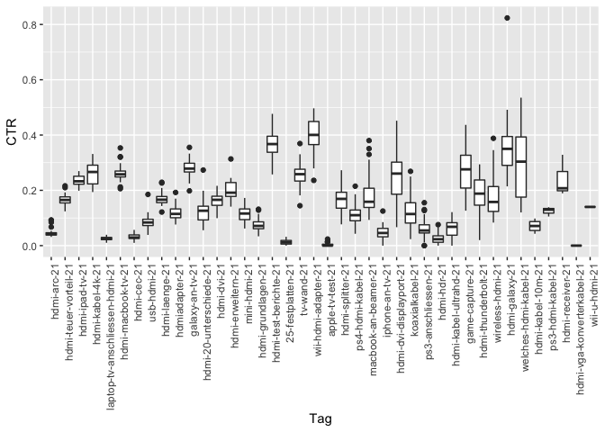

Wie verhält sich die CTR im Vergleich zu Seitenaufrufen? Schwankt die CTR in Abhängigkeit von den absoluten Seitenaufrufen? Zur Verdeutlichung schauen wir uns den direkten Zusammenhang zwischen Klicks und Pageviews an. Sollte die CTR konstant sein, müssten die Punkte durch eine Regressionsgerade verbunden werden können.

Erkenntnis: Es existiert tatsächlich ein linearer Zusammenhang, je mehr Pageviews, desto mehr Klicks. Allerdings scheinen hier mindestens 2 Gruppen von Daten zu existieren, einige mit guter und einige mit schlechter Performance.

Die Modellierung des CTR-Benchmarks sollte mindestens in Abhängigkeit der Pageviews durchgeführt werden.

``` r
weekly_raw_tbl %>%
  filter(Pageviews >= 50) %>% 
  select(Klicks, Pageviews) %>%
  ggplot(aes(y=Klicks, x=Pageviews)) +
  geom_point()
```

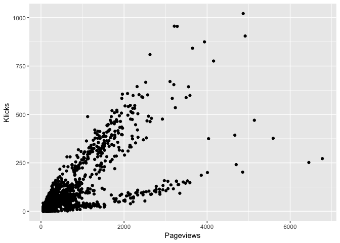

Modellierungsversuch der o.g. Verteilung:

``` r
clicks_lm <- lm(Klicks ~ Pageviews, data = weekly_raw_tbl)
predicted_clicks <- data.frame(Klicks_Prediction = predict(clicks_lm, weekly_raw_tbl), Pageviews=weekly_raw_tbl$Pageviews)

weekly_raw_tbl %>%
  filter(Pageviews >= 1) %>% 
  select(Klicks, Pageviews) %>%
  ggplot(aes(y=Klicks, x=Pageviews)) +
  geom_point() +
  geom_line(data=predicted_clicks, aes(x=Pageviews, y=Klicks_Prediction), color="blue")
```

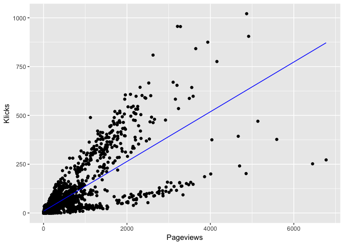

Qualität des Baseline-Modells: Schwache Resultate. Vor allem: Verlertzung der Annahme der Normalverteilung.

``` r
summary(clicks_lm) #r2 0.594
```

    ## 
    ## Call:
    ## lm(formula = Klicks ~ Pageviews, data = weekly_raw_tbl)
    ## 
    ## Residuals:
    ##     Min      1Q  Median      3Q     Max 
    ## -601.89  -10.45   -8.20    1.63  537.21 
    ## 
    ## Coefficients:
    ##             Estimate Std. Error t value Pr(>|t|)    
    ## (Intercept) 8.767708   1.410767   6.215 5.83e-10 ***
    ## Pageviews   0.127694   0.001906  66.996  < 2e-16 ***
    ## ---
    ## Signif. codes:  0 '***' 0.001 '**' 0.01 '*' 0.05 '.' 0.1 ' ' 1
    ## 
    ## Residual standard error: 69.54 on 3066 degrees of freedom
    ## Multiple R-squared:  0.5941, Adjusted R-squared:  0.594 
    ## F-statistic:  4488 on 1 and 3066 DF,  p-value: < 2.2e-16

``` r
plot(clicks_lm, which=1)
```

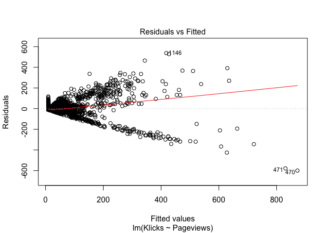

Cluster-Analyse: Auflösung der zwei Sub-Gruppen

``` r
ctr_df <- weekly_raw_tbl %>%
  filter(Pageviews > 1) %>% 
  select(Klicks, Pageviews, CTR, Tag) %>% 
  mutate(Klicks_scaled = scale(Klicks),
         Pageviews_scaled = scale(Pageviews))

ctr_cluster_list <- kmeans(ctr_df %>% select(Pageviews_scaled, Klicks_scaled), 10, nstart=50)

ctr_df$Cluster <- ctr_cluster_list$cluster

ctr_df <- ctr_df %>% 
  mutate(Cluster = as.factor(Cluster)) 

ctr_df %>% 
  ggplot(aes(x=Pageviews, y=Klicks, color=Cluster)) +
  geom_point()
```

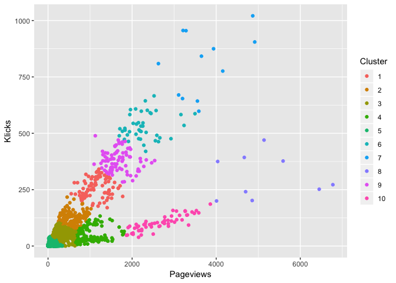

CTR-Analyse der Cluster

``` r
median_ctr <- median(ctr_df$CTR)

ctr_df %>% 
  ggplot(aes(x=Cluster, y=CTR)) +
  geom_boxplot() +
  geom_hline(yintercept = median_ctr)
```

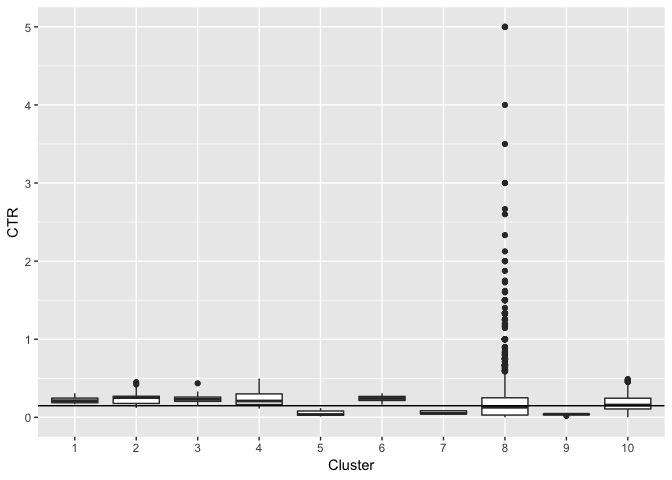

``` r
#Cluster aussortieren, die deutlich vom CTR-Median entfernt liegen.
clusters_perform <- ctr_df %>% 
  group_by(Cluster) %>% 
  summarise(CTR = median(CTR)) %>% 
  filter(CTR > median_ctr*0.5) %>% 
  select(Cluster) %>% 
  unlist
```

``` r
ctr_perform_df <- ctr_df %>% 
  filter(Cluster %in% clusters_perform) 

ctr_perform_df %>% 
  ggplot(aes(x=Pageviews, y=Klicks, color=Cluster)) +
  geom_point()
```

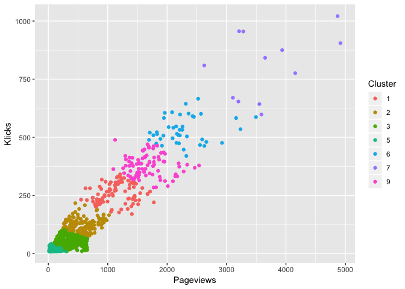

Modellierung: Regression nach Clustering Zuerst: Normalverteilung erreichen 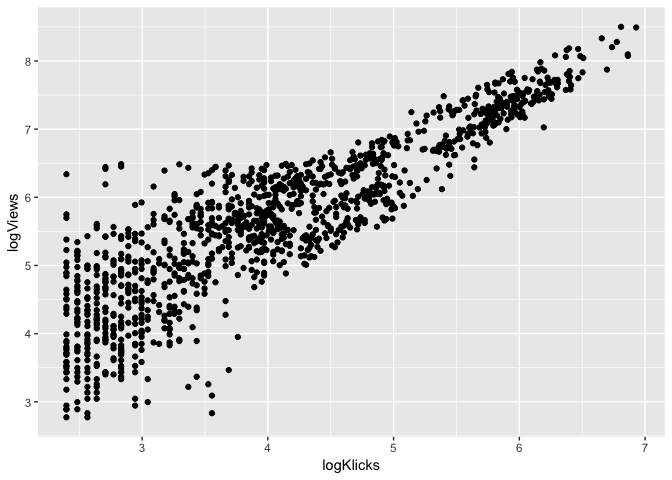

Neue Regressionsmodellierung

``` r
#Temporäres Modell zur Ausreißererkennung in den Reisduen
clicks_lm_1 <- lm(logKlicks ~ logViews, data = ctr_perform_df)
#Ausreißer markieren
ctr_perform_outliers <- hampel.proc(clicks_lm_1$residuals)

#Neues Modell ohne Ausreißer
clicks_lm_2 <- lm(logKlicks ~ logViews, data=ctr_perform_df[-ctr_perform_outliers,])
print(summary(clicks_lm_2)) #.83 r-squared
```

    ## 
    ## Call:
    ## lm(formula = logKlicks ~ logViews, data = ctr_perform_df[-ctr_perform_outliers, 
    ##     ])
    ## 
    ## Residuals:
    ##      Min       1Q   Median       3Q      Max 
    ## -2.18818 -0.42687  0.09484  0.51643  2.37083 
    ## 
    ## Coefficients:
    ##              Estimate Std. Error t value Pr(>|t|)    
    ## (Intercept) -1.142810   0.037883  -30.17   <2e-16 ***
    ## logViews     0.882212   0.008146  108.29   <2e-16 ***
    ## ---
    ## Signif. codes:  0 '***' 0.001 '**' 0.01 '*' 0.05 '.' 0.1 ' ' 1
    ## 
    ## Residual standard error: 0.7205 on 2327 degrees of freedom
    ## Multiple R-squared:  0.8344, Adjusted R-squared:  0.8344 
    ## F-statistic: 1.173e+04 on 1 and 2327 DF,  p-value: < 2.2e-16

``` r
plot(clicks_lm_2, which=1:4)
```

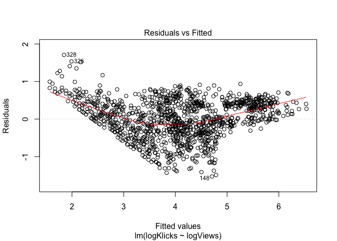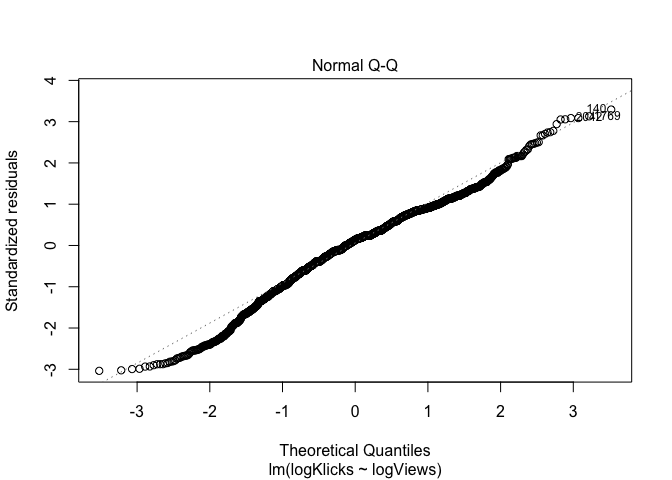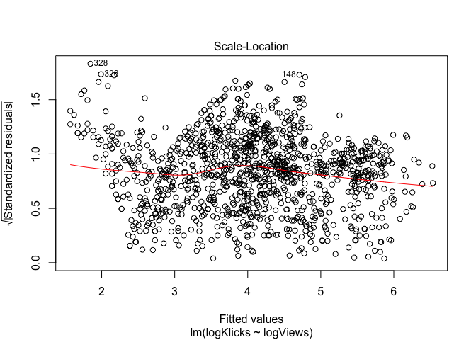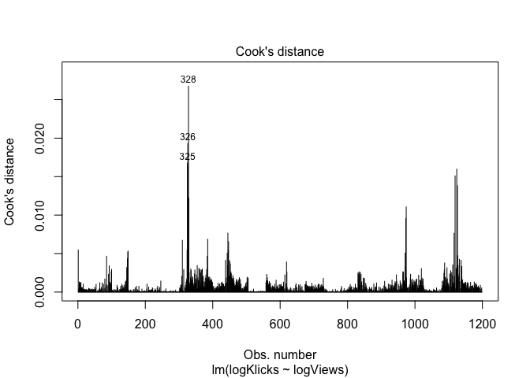

``` r
shapiro.test(clicks_lm_2$residuals) #.9755
```

    ## 
    ##  Shapiro-Wilk normality test
    ## 
    ## data:  clicks_lm_2$residuals
    ## W = 0.9824, p-value = 2.227e-16

``` r
#Normalverteilung der Residuen
clicks_lm_2$residuals %>% 
  as_tibble() %>% 
  rename(Residuals = value) %>% 
  ggplot(aes(x=Residuals)) +
  geom_histogram(binwidth = .5) +
  theme_minimal() +
  ggtitle("Residuals of Model Clicks_LM_2")
```

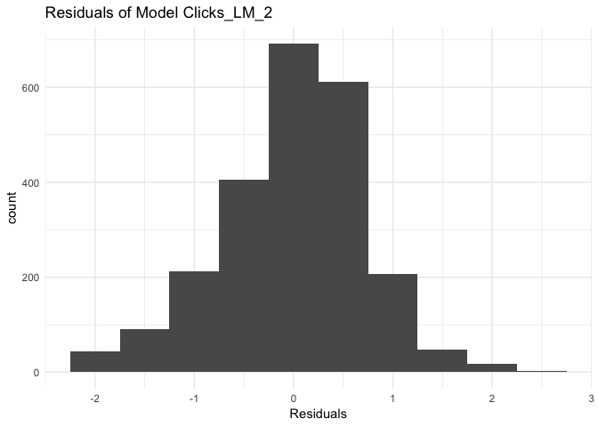

ausgewähltes Modell:

``` r
clicks_lm_2
```

    ## 
    ## Call:
    ## lm(formula = logKlicks ~ logViews, data = ctr_perform_df[-ctr_perform_outliers, 
    ##     ])
    ## 
    ## Coefficients:
    ## (Intercept)     logViews  
    ##     -1.1428       0.8822
